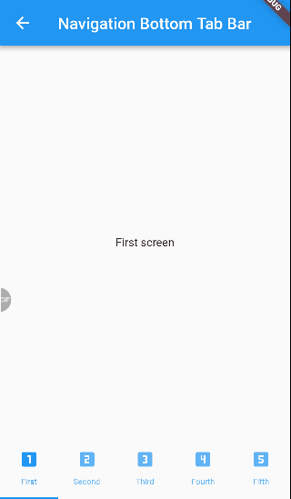

# :rocket: Flutter_simple

[Navigation](https://github.com/Goolpe/flutter_simple/blob/master/lib/examples/navigation/navigation.dart)

 - [Top TabBar Navigation]
 (https://github.com/Goolpe/flutter_simple/blob/master/lib/examples/navigation/navigationTopTabBar.dart) - [Bottom TabBar Navigation](https://github.com/Goolpe/flutter_simple/blob/master/lib/examples/navigation/navigationBottomTabBar.dart)

   